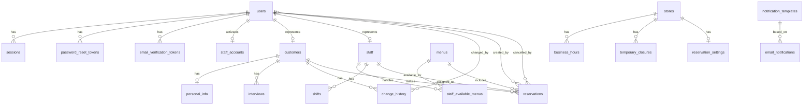

# データベース設計

## 概要

このドキュメントでは、接骨院・整骨院向けWeb予約システムのデータベース設計（論理設計）を定義します。

### 設計方針

1. **正規化**: 第3正規形を基本とし、必要に応じて非正規化
2. **整合性**: 外部キー制約とトランザクションで整合性を保証
3. **パフォーマンス**: 適切なインデックスの設定
4. **拡張性**: 将来的な機能追加を考慮した柔軟な設計
5. **技術非依存**: 特定のデータベースエンジンやORMに依存しない論理設計

## テーブル定義

### 1. Authentication ドメイン

#### 1.1 users テーブル

ユーザーアカウント（顧客・スタッフ共通）を管理します。

| カラム名 | データ型 | NULL | デフォルト | 制約 | 説明 |
|---------|---------|------|-----------|------|------|
| id | VARCHAR(255) | NOT NULL | | PRIMARY KEY | ユーザーID |
| email | VARCHAR(255) | NOT NULL | | UNIQUE | メールアドレス |
| email_verified | BOOLEAN | NOT NULL | FALSE | | メール確認済みフラグ |
| role | VARCHAR(50) | NOT NULL | | CHECK (role IN ('customer', 'staff', 'admin')) | ユーザーロール |
| auth_type | VARCHAR(50) | NOT NULL | | CHECK (auth_type IN ('email', 'sso')) | 認証タイプ |
| password_hash | VARCHAR(255) | NULL | | | パスワードハッシュ（Email認証のみ） |
| sso_provider | VARCHAR(50) | NULL | | CHECK (sso_provider IN ('google', 'facebook', 'line')) | SSOプロバイダー |
| sso_provider_id | VARCHAR(255) | NULL | | | SSOプロバイダーのユーザーID |
| created_at | TIMESTAMP | NOT NULL | | | 作成日時 |
| updated_at | TIMESTAMP | NOT NULL | | | 更新日時 |

**制約**:
- CHECK: Email認証の場合、password_hashが必須で、sso_providerとsso_provider_idはNULL
- CHECK: SSO認証の場合、password_hashはNULLで、sso_providerとsso_provider_idが必須
- UNIQUE: (sso_provider, sso_provider_id)

**インデックス**:
- idx_users_email: (email)
- idx_users_role: (role)
- idx_users_sso: (sso_provider, sso_provider_id)

#### 1.2 sessions テーブル

ユーザーのログインセッションを管理します。

| カラム名 | データ型 | NULL | デフォルト | 制約 | 説明 |
|---------|---------|------|-----------|------|------|
| id | VARCHAR(255) | NOT NULL | | PRIMARY KEY | セッションID |
| user_id | VARCHAR(255) | NOT NULL | | FOREIGN KEY → users(id) | ユーザーID |
| token | VARCHAR(255) | NOT NULL | | UNIQUE | セッショントークン |
| expires_at | TIMESTAMP | NOT NULL | | | 有効期限 |
| created_at | TIMESTAMP | NOT NULL | | | 作成日時 |

**外部キー**:
- user_id → users(id) ON DELETE CASCADE

**インデックス**:
- idx_sessions_user_id: (user_id)
- idx_sessions_token: (token)
- idx_sessions_expires_at: (expires_at)

#### 1.3 password_reset_tokens テーブル

パスワードリセット用のトークンを管理します。

| カラム名 | データ型 | NULL | デフォルト | 制約 | 説明 |
|---------|---------|------|-----------|------|------|
| id | VARCHAR(255) | NOT NULL | | PRIMARY KEY | トークンID |
| user_id | VARCHAR(255) | NOT NULL | | FOREIGN KEY → users(id) | ユーザーID |
| token | VARCHAR(255) | NOT NULL | | UNIQUE | リセットトークン |
| expires_at | TIMESTAMP | NOT NULL | | | 有効期限 |
| used | BOOLEAN | NOT NULL | FALSE | | 使用済みフラグ |
| created_at | TIMESTAMP | NOT NULL | | | 作成日時 |

**外部キー**:
- user_id → users(id) ON DELETE CASCADE

**インデックス**:
- idx_password_reset_tokens_token: (token)
- idx_password_reset_tokens_user_id: (user_id)

#### 1.4 email_verification_tokens テーブル

メールアドレス確認用のトークンを管理します。

| カラム名 | データ型 | NULL | デフォルト | 制約 | 説明 |
|---------|---------|------|-----------|------|------|
| id | VARCHAR(255) | NOT NULL | | PRIMARY KEY | トークンID |
| user_id | VARCHAR(255) | NOT NULL | | FOREIGN KEY → users(id) | ユーザーID |
| email | VARCHAR(255) | NOT NULL | | | 確認対象のメールアドレス |
| token | VARCHAR(255) | NOT NULL | | UNIQUE | 確認トークン |
| expires_at | TIMESTAMP | NOT NULL | | | 有効期限 |
| verified | BOOLEAN | NOT NULL | FALSE | | 確認済みフラグ |
| created_at | TIMESTAMP | NOT NULL | | | 作成日時 |

**外部キー**:
- user_id → users(id) ON DELETE CASCADE

**インデックス**:
- idx_email_verification_tokens_token: (token)
- idx_email_verification_tokens_user_id: (user_id)

#### 1.5 staff_accounts テーブル

スタッフアカウント招待を管理します。

| カラム名 | データ型 | NULL | デフォルト | 制約 | 説明 |
|---------|---------|------|-----------|------|------|
| id | VARCHAR(255) | NOT NULL | | PRIMARY KEY | スタッフアカウントID |
| email | VARCHAR(255) | NOT NULL | | UNIQUE | メールアドレス |
| role | VARCHAR(50) | NOT NULL | | CHECK (role IN ('staff', 'admin')) | スタッフロール |
| invitation_token | VARCHAR(255) | NOT NULL | | UNIQUE | 招待トークン |
| invitation_sent_at | TIMESTAMP | NOT NULL | | | 招待送信日時 |
| invitation_expires_at | TIMESTAMP | NOT NULL | | | 招待有効期限 |
| user_id | VARCHAR(255) | NULL | | UNIQUE, FOREIGN KEY → users(id) | アクティベート後のユーザーID |
| activated_at | TIMESTAMP | NULL | | | アクティベート日時 |
| created_at | TIMESTAMP | NOT NULL | | | 作成日時 |
| updated_at | TIMESTAMP | NOT NULL | | | 更新日時 |

**外部キー**:
- user_id → users(id) ON DELETE SET NULL

**インデックス**:
- idx_staff_accounts_email: (email)
- idx_staff_accounts_invitation_token: (invitation_token)
- idx_staff_accounts_user_id: (user_id)

### 2. Customer ドメイン

#### 2.1 customers テーブル

顧客の基本情報を管理します。

| カラム名 | データ型 | NULL | デフォルト | 制約 | 説明 |
|---------|---------|------|-----------|------|------|
| id | VARCHAR(255) | NOT NULL | | PRIMARY KEY | 顧客ID |
| user_id | VARCHAR(255) | NOT NULL | | UNIQUE, FOREIGN KEY → users(id) | ユーザーID |
| first_name | VARCHAR(50) | NOT NULL | | | 名 |
| last_name | VARCHAR(50) | NOT NULL | | | 姓 |
| first_name_kana | VARCHAR(50) | NOT NULL | | | 名（カナ） |
| last_name_kana | VARCHAR(50) | NOT NULL | | | 姓（カナ） |
| email | VARCHAR(255) | NOT NULL | | | メールアドレス |
| phone_number | VARCHAR(11) | NOT NULL | | | 電話番号 |
| created_at | TIMESTAMP | NOT NULL | | | 作成日時 |
| updated_at | TIMESTAMP | NOT NULL | | | 更新日時 |

**外部キー**:
- user_id → users(id) ON DELETE CASCADE

**インデックス**:
- idx_customers_user_id: (user_id)
- idx_customers_email: (email)
- idx_customers_phone_number: (phone_number)
- idx_customers_name: (last_name, first_name)

#### 2.2 personal_info テーブル

顧客の追加個人情報を管理します。

| カラム名 | データ型 | NULL | デフォルト | 制約 | 説明 |
|---------|---------|------|-----------|------|------|
| customer_id | VARCHAR(255) | NOT NULL | | PRIMARY KEY, FOREIGN KEY → customers(id) | 顧客ID |
| postal_code | VARCHAR(7) | NULL | | | 郵便番号 |
| prefecture | VARCHAR(10) | NULL | | | 都道府県 |
| city | VARCHAR(50) | NULL | | | 市区町村 |
| street_address | VARCHAR(100) | NULL | | | 番地 |
| building | VARCHAR(100) | NULL | | | 建物名・部屋番号 |
| date_of_birth | DATE | NULL | | | 生年月日 |
| gender | VARCHAR(10) | NULL | | CHECK (gender IN ('male', 'female', 'other')) | 性別 |
| occupation | VARCHAR(50) | NULL | | | 職業 |
| is_sports_active | BOOLEAN | NULL | | | スポーツ実施フラグ |
| sports_name | VARCHAR(100) | NULL | | | 競技名 |
| sports_affiliation | VARCHAR(100) | NULL | | | 所属 |
| emergency_contact_name | VARCHAR(50) | NULL | | | 緊急連絡先氏名 |
| emergency_contact_relationship | VARCHAR(50) | NULL | | | 緊急連絡先続柄 |
| emergency_contact_phone | VARCHAR(11) | NULL | | | 緊急連絡先電話番号 |
| created_at | TIMESTAMP | NOT NULL | | | 作成日時 |
| updated_at | TIMESTAMP | NOT NULL | | | 更新日時 |

**外部キー**:
- customer_id → customers(id) ON DELETE CASCADE

**制約**:
- CHECK: 緊急連絡先は全項目セットまたは全項目NULL

#### 2.3 interviews テーブル

顧客の問診情報を管理します。

| カラム名 | データ型 | NULL | デフォルト | 制約 | 説明 |
|---------|---------|------|-----------|------|------|
| id | VARCHAR(255) | NOT NULL | | PRIMARY KEY | 問診ID |
| customer_id | VARCHAR(255) | NOT NULL | | FOREIGN KEY → customers(id) | 顧客ID |
| visit_purpose | TEXT | NOT NULL | | | 来院目的 |
| main_symptoms | TEXT | NOT NULL | | | 主な症状 |
| symptom_onset_date | DATE | NULL | | | 症状発生時期 |
| symptom_cause | TEXT | NULL | | | 症状の原因・きっかけ |
| pain_level | INT | NULL | | CHECK (pain_level >= 0 AND pain_level <= 10) | 痛みの程度（0-10） |
| medical_history | TEXT | NULL | | | 既往歴 |
| current_treatments | TEXT | NULL | | | 現在治療中の疾患 |
| medications | TEXT | NULL | | | 服用中の薬 |
| allergies | TEXT | NULL | | | アレルギーの有無 |
| notes | TEXT | NULL | | | その他特記事項 |
| created_at | TIMESTAMP | NOT NULL | | | 作成日時 |
| updated_at | TIMESTAMP | NOT NULL | | | 更新日時 |

**外部キー**:
- customer_id → customers(id) ON DELETE CASCADE

**インデックス**:
- idx_interviews_customer_id: (customer_id)

#### 2.4 change_history テーブル

顧客情報の変更履歴を管理します。

| カラム名 | データ型 | NULL | デフォルト | 制約 | 説明 |
|---------|---------|------|-----------|------|------|
| id | VARCHAR(255) | NOT NULL | | PRIMARY KEY | 履歴ID |
| customer_id | VARCHAR(255) | NOT NULL | | FOREIGN KEY → customers(id) | 顧客ID |
| changed_by | VARCHAR(255) | NOT NULL | | FOREIGN KEY → users(id) | 変更者ユーザーID |
| changed_fields | JSON | NOT NULL | | | 変更内容（JSON配列） |
| changed_at | TIMESTAMP | NOT NULL | | | 変更日時 |

**外部キー**:
- customer_id → customers(id) ON DELETE CASCADE
- changed_by → users(id) ON DELETE SET NULL

**インデックス**:
- idx_change_history_customer_id: (customer_id)
- idx_change_history_changed_at: (changed_at)

**JSON構造（changed_fields）**:
```json
[
  {
    "fieldName": "phoneNumber",
    "oldValue": "09012345678",
    "newValue": "09087654321"
  }
]
```

### 3. Menu ドメイン

#### 3.1 menus テーブル

施術メニューを管理します。

| カラム名 | データ型 | NULL | デフォルト | 制約 | 説明 |
|---------|---------|------|-----------|------|------|
| id | VARCHAR(255) | NOT NULL | | PRIMARY KEY | メニューID |
| name | VARCHAR(100) | NOT NULL | | UNIQUE | メニュー名 |
| description | TEXT | NOT NULL | | | 概要 |
| image_url | VARCHAR(500) | NULL | | | 画像URL |
| duration_minutes | INT | NOT NULL | | CHECK (duration_minutes > 0) | 所要時間（分） |
| billing_type | VARCHAR(50) | NOT NULL | | CHECK (billing_type IN ('self-pay', 'insurance')) | 料金区分 |
| price | INT | NULL | | CHECK (price >= 0 AND price <= 1000000) | 料金（円） |
| created_at | TIMESTAMP | NOT NULL | | | 作成日時 |
| updated_at | TIMESTAMP | NOT NULL | | | 更新日時 |

**制約**:
- CHECK: 自費診療の場合priceが必須、保険適用の場合priceはNULL

**インデックス**:
- idx_menus_name: (name)
- idx_menus_billing_type: (billing_type)

### 4. Staff ドメイン

#### 4.1 staff テーブル

スタッフ情報を管理します。

| カラム名 | データ型 | NULL | デフォルト | 制約 | 説明 |
|---------|---------|------|-----------|------|------|
| id | VARCHAR(255) | NOT NULL | | PRIMARY KEY | スタッフID |
| user_id | VARCHAR(255) | NULL | | UNIQUE, FOREIGN KEY → users(id) | ユーザーID |
| name | VARCHAR(50) | NOT NULL | | | スタッフ名 |
| image_url | VARCHAR(500) | NULL | | | スタッフ画像URL |
| type | VARCHAR(50) | NOT NULL | | CHECK (type IN ('full-time', 'part-time')) | スタッフタイプ |
| default_working_hours | JSON | NULL | | | デフォルト勤務時間（常勤のみ） |
| created_at | TIMESTAMP | NOT NULL | | | 作成日時 |
| updated_at | TIMESTAMP | NOT NULL | | | 更新日時 |

**外部キー**:
- user_id → users(id) ON DELETE SET NULL

**制約**:
- CHECK: 常勤スタッフの場合default_working_hoursが必須、非常勤の場合NULL

**インデックス**:
- idx_staff_user_id: (user_id)
- idx_staff_name: (name)

**JSON構造（default_working_hours）**:
```json
{
  "periods": [
    {"startTime": "09:00", "endTime": "12:00"},
    {"startTime": "14:00", "endTime": "18:00"}
  ]
}
```

#### 4.2 staff_available_menus テーブル

スタッフが対応可能なメニューを管理します（中間テーブル）。

| カラム名 | データ型 | NULL | デフォルト | 制約 | 説明 |
|---------|---------|------|-----------|------|------|
| staff_id | VARCHAR(255) | NOT NULL | | PRIMARY KEY, FOREIGN KEY → staff(id) | スタッフID |
| menu_id | VARCHAR(255) | NOT NULL | | PRIMARY KEY, FOREIGN KEY → menus(id) | メニューID |
| created_at | TIMESTAMP | NOT NULL | | | 作成日時 |

**外部キー**:
- staff_id → staff(id) ON DELETE CASCADE
- menu_id → menus(id) ON DELETE CASCADE

**複合主キー**:
- (staff_id, menu_id)

**インデックス**:
- idx_staff_available_menus_staff_id: (staff_id)
- idx_staff_available_menus_menu_id: (menu_id)

#### 4.3 shifts テーブル

スタッフのシフト情報を管理します。

| カラム名 | データ型 | NULL | デフォルト | 制約 | 説明 |
|---------|---------|------|-----------|------|------|
| id | VARCHAR(255) | NOT NULL | | PRIMARY KEY | シフトID |
| staff_id | VARCHAR(255) | NOT NULL | | FOREIGN KEY → staff(id) | スタッフID |
| date | DATE | NOT NULL | | | 日付 |
| working_hours | JSON | NULL | | | 勤務時間 |
| is_off | BOOLEAN | NOT NULL | FALSE | | 休みフラグ |
| created_at | TIMESTAMP | NOT NULL | | | 作成日時 |
| updated_at | TIMESTAMP | NOT NULL | | | 更新日時 |

**外部キー**:
- staff_id → staff(id) ON DELETE CASCADE

**制約**:
- UNIQUE: (staff_id, date)

**インデックス**:
- idx_shifts_staff_id: (staff_id)
- idx_shifts_date: (date)
- idx_shifts_staff_id_date: (staff_id, date)

**JSON構造（working_hours）**:
```json
{
  "periods": [
    {"startTime": "09:00", "endTime": "12:00"},
    {"startTime": "14:00", "endTime": "18:00"}
  ]
}
```

### 5. Store ドメイン

#### 5.1 stores テーブル

店舗情報を管理します（システム全体で1つのみ）。

| カラム名 | データ型 | NULL | デフォルト | 制約 | 説明 |
|---------|---------|------|-----------|------|------|
| id | VARCHAR(255) | NOT NULL | | PRIMARY KEY | 店舗ID |
| name | VARCHAR(100) | NOT NULL | | | 店舗名 |
| postal_code | VARCHAR(7) | NOT NULL | | | 郵便番号 |
| prefecture | VARCHAR(10) | NOT NULL | | | 都道府県 |
| city | VARCHAR(50) | NOT NULL | | | 市区町村 |
| street_address | VARCHAR(100) | NOT NULL | | | 番地 |
| building | VARCHAR(100) | NULL | | | 建物名・部屋番号 |
| phone_number | VARCHAR(11) | NOT NULL | | | 電話番号 |
| email | VARCHAR(255) | NULL | | | メールアドレス |
| description | TEXT | NULL | | | 説明 |
| created_at | TIMESTAMP | NOT NULL | | | 作成日時 |
| updated_at | TIMESTAMP | NOT NULL | | | 更新日時 |

#### 5.2 business_hours テーブル

営業時間を管理します。

| カラム名 | データ型 | NULL | デフォルト | 制約 | 説明 |
|---------|---------|------|-----------|------|------|
| id | VARCHAR(255) | NOT NULL | | PRIMARY KEY | 営業時間ID |
| store_id | VARCHAR(255) | NOT NULL | | FOREIGN KEY → stores(id) | 店舗ID |
| day_of_week | INT | NOT NULL | | CHECK (day_of_week >= 0 AND day_of_week <= 6) | 曜日（0:日曜〜6:土曜） |
| periods | JSON | NOT NULL | | | 営業時間帯 |
| is_closed | BOOLEAN | NOT NULL | FALSE | | 定休日フラグ |
| created_at | TIMESTAMP | NOT NULL | | | 作成日時 |
| updated_at | TIMESTAMP | NOT NULL | | | 更新日時 |

**外部キー**:
- store_id → stores(id) ON DELETE CASCADE

**制約**:
- UNIQUE: (store_id, day_of_week)

**インデックス**:
- idx_business_hours_store_id: (store_id)
- idx_business_hours_day_of_week: (day_of_week)

**JSON構造（periods）**:
```json
[
  {"startTime": "09:00", "endTime": "12:00"},
  {"startTime": "14:00", "endTime": "18:00"}
]
```

#### 5.3 temporary_closures テーブル

臨時休業を管理します。

| カラム名 | データ型 | NULL | デフォルト | 制約 | 説明 |
|---------|---------|------|-----------|------|------|
| id | VARCHAR(255) | NOT NULL | | PRIMARY KEY | 臨時休業ID |
| store_id | VARCHAR(255) | NOT NULL | | FOREIGN KEY → stores(id) | 店舗ID |
| date | DATE | NOT NULL | | | 休業日 |
| reason | TEXT | NULL | | | 理由 |
| created_at | TIMESTAMP | NOT NULL | | | 作成日時 |
| updated_at | TIMESTAMP | NOT NULL | | | 更新日時 |

**外部キー**:
- store_id → stores(id) ON DELETE CASCADE

**制約**:
- UNIQUE: (store_id, date)

**インデックス**:
- idx_temporary_closures_store_id: (store_id)
- idx_temporary_closures_date: (date)

#### 5.4 reservation_settings テーブル

予約設定を管理します（システム全体で1つのみ）。

| カラム名 | データ型 | NULL | デフォルト | 制約 | 説明 |
|---------|---------|------|-----------|------|------|
| id | VARCHAR(255) | NOT NULL | | PRIMARY KEY | 予約設定ID |
| store_id | VARCHAR(255) | NOT NULL | | UNIQUE, FOREIGN KEY → stores(id) | 店舗ID |
| slot_duration_minutes | INT | NOT NULL | | CHECK (slot_duration_minutes > 0) | 予約枠の時間間隔（分） |
| max_reservations_per_slot | INT | NOT NULL | | CHECK (max_reservations_per_slot > 0) | 1枠あたりの最大予約数 |
| reservation_deadline_hours | INT | NOT NULL | | CHECK (reservation_deadline_hours >= 0) | 予約受付期限（時間） |
| cancellation_deadline_hours | INT | NOT NULL | | CHECK (cancellation_deadline_hours >= 0) | キャンセル受付期限（時間） |
| update_deadline_hours | INT | NOT NULL | | CHECK (update_deadline_hours >= 0) | 変更受付期限（時間） |
| reminder_enabled | BOOLEAN | NOT NULL | FALSE | | リマインドメール有効フラグ |
| reminder_hours_before | INT | NOT NULL | | CHECK (reminder_hours_before >= 0) | リマインド送信時刻（時間前） |
| staff_selection_required | BOOLEAN | NOT NULL | FALSE | | スタッフ選択必須フラグ |
| created_at | TIMESTAMP | NOT NULL | | | 作成日時 |
| updated_at | TIMESTAMP | NOT NULL | | | 更新日時 |

**外部キー**:
- store_id → stores(id) ON DELETE CASCADE

### 6. Reservation ドメイン

#### 6.1 reservations テーブル

予約情報を管理します。

| カラム名 | データ型 | NULL | デフォルト | 制約 | 説明 |
|---------|---------|------|-----------|------|------|
| id | VARCHAR(255) | NOT NULL | | PRIMARY KEY | 予約ID |
| customer_id | VARCHAR(255) | NOT NULL | | FOREIGN KEY → customers(id) | 顧客ID |
| menu_id | VARCHAR(255) | NOT NULL | | FOREIGN KEY → menus(id) | メニューID |
| staff_id | VARCHAR(255) | NULL | | FOREIGN KEY → staff(id) | スタッフID |
| start_time | TIMESTAMP | NOT NULL | | | 開始時刻 |
| end_time | TIMESTAMP | NOT NULL | | | 終了時刻 |
| status | VARCHAR(50) | NOT NULL | | CHECK (status IN ('pending', 'confirmed', 'cancelled', 'arrived', 'no-show')) | ステータス |
| cancelled_by | VARCHAR(255) | NULL | | FOREIGN KEY → users(id) | キャンセル者ID |
| cancelled_at | TIMESTAMP | NULL | | | キャンセル日時 |
| cancellation_reason | TEXT | NULL | | | キャンセル理由 |
| arrived_at | TIMESTAMP | NULL | | | 来院日時 |
| no_show_reason | TEXT | NULL | | | No-show理由 |
| created_by | VARCHAR(255) | NOT NULL | | FOREIGN KEY → users(id) | 作成者ID |
| created_at | TIMESTAMP | NOT NULL | | | 作成日時 |
| updated_at | TIMESTAMP | NOT NULL | | | 更新日時 |

**外部キー**:
- customer_id → customers(id) ON DELETE RESTRICT
- menu_id → menus(id) ON DELETE RESTRICT
- staff_id → staff(id) ON DELETE RESTRICT
- cancelled_by → users(id) ON DELETE SET NULL
- created_by → users(id) ON DELETE SET NULL

**制約**:
- CHECK: status='cancelled'の場合、cancelled_byとcancelled_atが必須
- CHECK: status='arrived'の場合、arrived_atが必須

**インデックス**:
- idx_reservations_customer_id: (customer_id)
- idx_reservations_menu_id: (menu_id)
- idx_reservations_staff_id: (staff_id)
- idx_reservations_start_time: (start_time)
- idx_reservations_end_time: (end_time)
- idx_reservations_status: (status)
- idx_reservations_time_range: (start_time, end_time)

### 7. Notification ドメイン

#### 7.1 email_notifications テーブル

メール通知の送信履歴を管理します。

| カラム名 | データ型 | NULL | デフォルト | 制約 | 説明 |
|---------|---------|------|-----------|------|------|
| id | VARCHAR(255) | NOT NULL | | PRIMARY KEY | 通知ID |
| type | VARCHAR(50) | NOT NULL | | CHECK (type IN ('reservation-confirmation', 'reservation-update', 'reservation-cancellation', 'reservation-reminder', 'email-verification', 'password-reset', 'staff-invitation', 'account-deletion')) | 通知タイプ |
| recipient_email | VARCHAR(255) | NOT NULL | | | 宛先メールアドレス |
| subject | VARCHAR(255) | NOT NULL | | | 件名 |
| body | TEXT | NOT NULL | | | 本文 |
| sent_at | TIMESTAMP | NULL | | | 送信日時 |
| failed_at | TIMESTAMP | NULL | | | 失敗日時 |
| failure_reason | TEXT | NULL | | | 失敗理由 |
| metadata | JSON | NOT NULL | | | メタデータ |
| created_at | TIMESTAMP | NOT NULL | | | 作成日時 |
| updated_at | TIMESTAMP | NOT NULL | | | 更新日時 |

**インデックス**:
- idx_email_notifications_recipient_email: (recipient_email)
- idx_email_notifications_type: (type)
- idx_email_notifications_sent_at: (sent_at)
- idx_email_notifications_failed_at: (failed_at)

**JSON構造（metadata）**:
```json
{
  "reservationId": "xxx",
  "customerId": "yyy"
}
```

#### 7.2 notification_templates テーブル

メール通知のテンプレートを管理します。

| カラム名 | データ型 | NULL | デフォルト | 制約 | 説明 |
|---------|---------|------|-----------|------|------|
| id | VARCHAR(255) | NOT NULL | | PRIMARY KEY | テンプレートID |
| type | VARCHAR(50) | NOT NULL | | UNIQUE, CHECK (type IN ('reservation-confirmation', 'reservation-update', 'reservation-cancellation', 'reservation-reminder', 'email-verification', 'password-reset', 'staff-invitation', 'account-deletion')) | 通知タイプ |
| subject | VARCHAR(255) | NOT NULL | | | 件名テンプレート |
| body_template | TEXT | NOT NULL | | | 本文テンプレート |
| variables | JSON | NOT NULL | | | 変数リスト |
| created_at | TIMESTAMP | NOT NULL | | | 作成日時 |
| updated_at | TIMESTAMP | NOT NULL | | | 更新日時 |

**インデックス**:
- idx_notification_templates_type: (type)

**JSON構造（variables）**:
```json
["customerName", "reservationDate", "reservationTime", "storeName"]
```

## データ型の扱い

### 標準データ型

| 論理型 | 説明 | 実装例 |
|--------|------|--------|
| VARCHAR(n) | 可変長文字列 | PostgreSQL: VARCHAR(n), MySQL: VARCHAR(n), SQLite: TEXT |
| TEXT | 長文テキスト | PostgreSQL: TEXT, MySQL: TEXT, SQLite: TEXT |
| INT | 整数 | PostgreSQL: INTEGER, MySQL: INT, SQLite: INTEGER |
| BOOLEAN | 真偽値 | PostgreSQL: BOOLEAN, MySQL: TINYINT(1), SQLite: INTEGER(0/1) |
| TIMESTAMP | 日時 | PostgreSQL: TIMESTAMP, MySQL: DATETIME, SQLite: TEXT(ISO 8601) |
| DATE | 日付 | PostgreSQL: DATE, MySQL: DATE, SQLite: TEXT(YYYY-MM-DD) |
| JSON | JSON | PostgreSQL: JSONB, MySQL: JSON, SQLite: TEXT |

### 日付・時刻の扱い

- **DATE**: `YYYY-MM-DD` 形式（例: `2025-11-16`）
- **TIMESTAMP**: ISO 8601形式（例: `2025-11-16T10:30:00.000Z`）
- タイムゾーンはUTCで統一することを推奨

### JSON型の扱い

複雑なデータ構造（配列、オブジェクト）はJSON形式で保存します。データベースエンジンがネイティブJSON型をサポートしている場合はそれを使用し、そうでない場合はTEXT型で保存します。

## インデックス戦略

### 主要なクエリパターン

1. **ユーザー認証**:
   - Email/パスワードによるログイン: `users(email)`
   - SSO認証: `users(sso_provider, sso_provider_id)`
   - セッショントークンによる認証: `sessions(token)`

2. **顧客検索**:
   - 名前検索: `customers(last_name, first_name)`
   - Email検索: `customers(email)`
   - 電話番号検索: `customers(phone_number)`

3. **予約検索**:
   - 顧客の予約一覧: `reservations(customer_id)`
   - 日付範囲での検索: `reservations(start_time, end_time)`
   - スタッフの予約一覧: `reservations(staff_id)`
   - ステータスによるフィルタ: `reservations(status)`

4. **シフト検索**:
   - スタッフと日付での検索: `shifts(staff_id, date)`

### 複合インデックス

効率的なクエリのために、以下の複合インデックスを設定します:

- `reservations(start_time, end_time)`: 時間範囲での予約検索
- `shifts(staff_id, date)`: スタッフのシフト検索
- `users(sso_provider, sso_provider_id)`: SSO認証
- `customers(last_name, first_name)`: 名前による顧客検索

## 外部キー制約

### CASCADE 設定

以下の関係では、親レコードの削除時に子レコードも削除します（`ON DELETE CASCADE`）:

- `users` → `sessions`: ユーザー削除時にセッションも削除
- `users` → `password_reset_tokens`: ユーザー削除時にトークンも削除
- `users` → `email_verification_tokens`: ユーザー削除時にトークンも削除
- `users` → `customers`: ユーザー削除時に顧客情報も削除
- `customers` → `personal_info`: 顧客削除時に追加情報も削除
- `customers` → `interviews`: 顧客削除時に問診情報も削除
- `customers` → `change_history`: 顧客削除時に変更履歴も削除
- `staff` → `staff_available_menus`: スタッフ削除時に対応メニュー情報も削除
- `staff` → `shifts`: スタッフ削除時にシフトも削除
- `stores` → `business_hours`: 店舗削除時に営業時間も削除
- `stores` → `temporary_closures`: 店舗削除時に臨時休業情報も削除
- `stores` → `reservation_settings`: 店舗削除時に予約設定も削除

### RESTRICT 設定

以下の関係では、子レコードが存在する場合に親レコードの削除を禁止します（`ON DELETE RESTRICT`）:

- `customers` → `reservations`: 予約がある顧客は削除不可
- `menus` → `reservations`: 予約があるメニューは削除不可
- `staff` → `reservations`: 予約があるスタッフは削除不可

### SET NULL 設定

以下の関係では、親レコードの削除時に外部キーをNULLに設定します（`ON DELETE SET NULL`）:

- `users` → `staff_accounts(user_id)`: ユーザー削除時にスタッフアカウントのuser_idをNULL化
- `users` → `staff(user_id)`: ユーザー削除時にスタッフのuser_idをNULL化
- `users` → `change_history(changed_by)`: ユーザー削除時に変更者IDをNULL化
- `users` → `reservations(cancelled_by)`: ユーザー削除時にキャンセル者IDをNULL化
- `users` → `reservations(created_by)`: ユーザー削除時に作成者IDをNULL化

## トランザクション管理

### 重要なトランザクション

以下の操作は、データの整合性を保つためにトランザクション内で実行する必要があります:

1. **予約作成**:
   - 予約可能枠のチェック
   - 重複予約のチェック
   - 予約の作成
   - メール通知の記録

2. **予約変更**:
   - 予約の取得とロック
   - 新しい時間枠のチェック
   - 予約の更新
   - メール通知の記録

3. **顧客削除**:
   - 有効な予約があるかチェック
   - 関連データの削除（PersonalInfo, Interview, ChangeHistory）
   - Customer削除
   - User削除

4. **メニュー/スタッフ削除**:
   - 有効な予約があるかチェック
   - 関連データの削除
   - メニュー/スタッフの削除

### 同時実行制御

重複予約を防ぐために、以下の方法を検討します:

1. **楽観的ロック**: バージョン番号を使用し、更新時に競合を検出
2. **悲観的ロック**: データベースレベルでロックを取得（SELECT FOR UPDATE）
3. **アプリケーションレベルのロック**: 分散ロックなどを使用

## データ整合性チェック

定期的に以下のチェックを実施することを推奨します:

1. **孤立レコードの検出**:
   - 外部キー制約があるにもかかわらず、参照先が存在しないレコード

2. **データの矛盾チェック**:
   - ステータスと関連フィールドの整合性
   - 予約の開始・終了時刻の整合性

3. **制約違反のチェック**:
   - CHECK制約の妥当性
   - UNIQUE制約の重複

## 拡張性

### 将来的な拡張

1. **複数店舗対応**:
   - `stores`テーブルの複数レコード対応
   - すべてのテーブルに`store_id`カラムを追加

2. **多言語対応**:
   - `notification_templates`に言語カラムを追加
   - メニューや店舗情報の多言語化テーブルを追加

3. **決済機能**:
   - `payments`テーブルの追加
   - 決済履歴の管理

4. **カルテ機能**:
   - `medical_records`テーブルの追加
   - 施術記録の管理

5. **レポート機能**:
   - 集計データの保存（`daily_summaries`など）
   - 分析用のビューの作成

## ER図



## まとめ

このデータベース設計は、以下の特徴を持ちます:

1. **DDDに基づいた設計**: ドメインモデルを忠実に反映した論理設計
2. **技術非依存**: 特定のデータベースエンジンやORMに依存しない汎用的な設計
3. **整合性**: 外部キー制約とトランザクションによるデータ整合性の保証
4. **パフォーマンス**: 適切なインデックス戦略による効率的なクエリ実行
5. **拡張性**: 将来的な機能追加を考慮した柔軟な設計
6. **保守性**: 正規化とビジネスルールの明確化による保守性の向上

この論理設計を基に、実際に使用するデータベースエンジン（PostgreSQL、MySQL、SQLite等）とORM（Drizzle、Prisma、TypeORM等）に合わせた物理設計と実装を行います。
